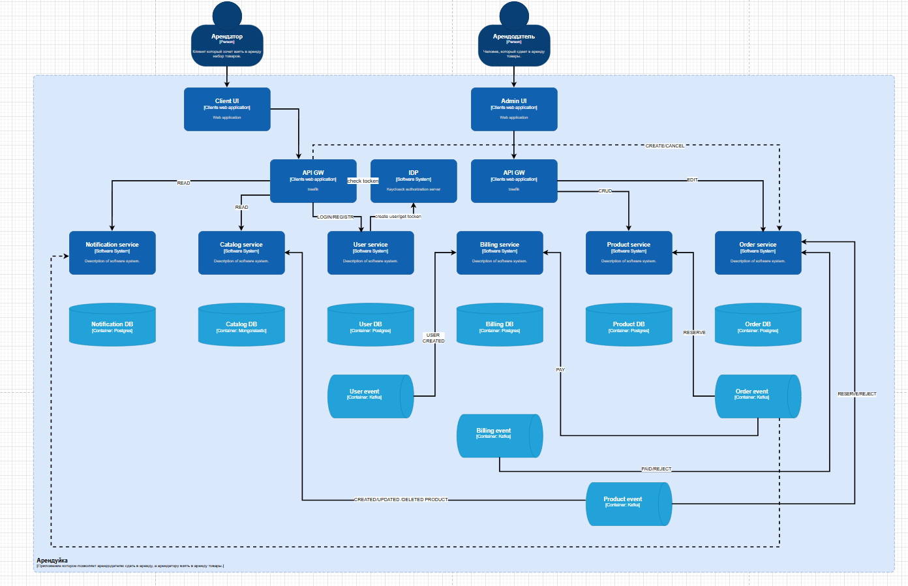
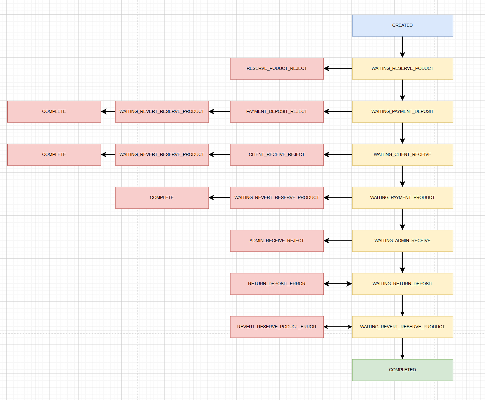
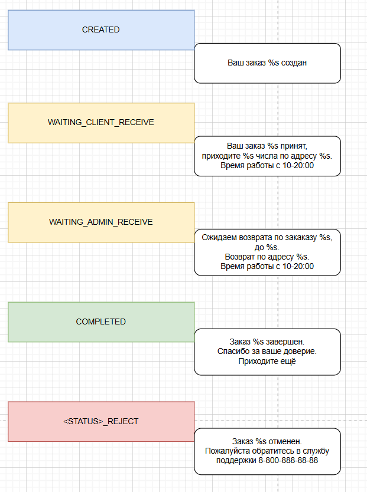

# Онлайн сервис для аренды товаров

#### Общие сценарии

1. Регистрация
2. Авторизация

#### Основные сценарии клиента

1. Посмотреть каталог товаров и их наличие
2. Сделать бронь на определенную дату
3. Внести предоплату
4. Получить уведомление о успешном или неуспешном бронировании.
5. Внести залог при получении товара.
6. Получить товар.
7. Вернуть товар.
8. Получить залог.
9. Получить уведомление о завершении аренды.

#### Основные сценарии арендодателя

1. Добавить, удалить, редактировать товары в каталоге.
2. Подтвердить\Отклонить бронь
3. Принять товар вернуть залог.
4. (Не)Принять товар забрать залог.

#### На будущее для клиента

1. Оставить оценку/ отзыв арендодателю.
2. Поблагодарить финансово.
3. Поставить оценку/ отзыв товару.

#### На будущее для арендодателя

1. Поставить оценку/ отзыв клиенту.
2. Добавить удалить клиента в черный список.

[C4 схема](doc/с4/c4-container-schema.drawio)
 

##### Статусная модель заказа

 

##### Уведомления

 
#### Инструкция по установке приложения

##### установка инфраструктуры

#### [Установка postgres](/doc/postgres.md)

#### [Установка keycloak](doc/keycloak.md)

#### [Установка traefick](doc/install-traefik.md)

#### [Установка kafka](doc/kafka.md)

#### [Запуск приложения в minikube](/doc/start-app.md)

#### [Postman collection](/doc/postman/create-order-test.postman_collection.json)

#### [Postman env](/doc/postman/minikube.local.postman_environment.json)

#### установка сервисов

Также выполнить деплоймент сервисов user, order, billing, notification, product

helm install userservice .\helm-chart\user-service-chart -n otus-msa --create-namespace
 
helm install billingservice .\helm-chart\billing-service-chart -n otus-msa --create-namespace
 
helm install orderservice .\helm-chart\order-service-chart -n otus-msa --create-namespace
 
helm install notificationservice .\helm-chart\notification-service-chart -n otus-msa --create-namespace
 
helm install productservice .\helm-chart\product-service-chart -n otus-msa --create-namespace

helm upgrade --install userservice .\helm-chart\user-service-chart -n otus-msa --create-namespace
helm upgrade --install billingservice .\helm-chart\billing-service-chart -n otus-msa --create-namespace
helm upgrade --install orderservice .\helm-chart\order-service-chart -n otus-msa --create-namespace
helm upgrade --install notificationservice .\helm-chart\notification-service-chart -n otus-msa --create-namespace
helm upgrade --install productservice .\helm-chart\product-service-chart -n otus-msa --create-namespace

helm uninstall userservice -n otus-msa
helm uninstall billingservice -n otus-msa
helm uninstall orderservice -n otus-msa
helm uninstall notificationservice -n otus-msa
helm uninstall productservice -n otus-msa

