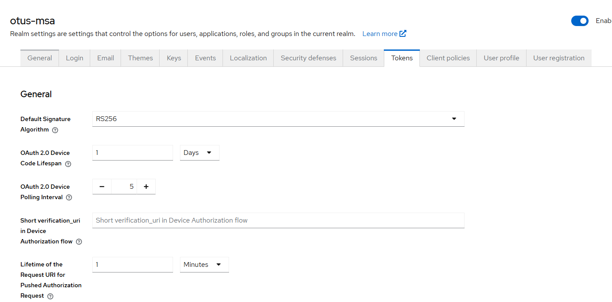

#### Для установки Keycloack в minkube

`kubectl create namespace otus-keycloack` чтобы поместить приложение в отдельный неймспейс
`helm install keycloack  oci://registry-1.docker.io/bitnamicharts/keycloak -n otus-kk --create-namespace -f ./helm-chart/infra/keycloak/values.yaml`
$SERVICE_PORT=$(kubectl get --namespace otus-keycloack -o jsonpath="{.spec.ports[?(@.name=='http')].port}" services keycloack-keycloak)

helm uninstall keycloack -n otus-kk

kubectl port-forward --namespace otus-kk svc/keycloack-keycloak 8086:80

1) create realm otus-msa
2) создаем user-service клиента
3) добавляем роли realm-admin, manage-users [png](/doc/img/user-service-keycloak-roles.png)
4) забираем user-service secret из kk и заменяем [keycloak.credentials.secret](/helm-chart/user-service-chart/templates/secret.yaml)
5) увеличиваем время жизни токена чтобы не логиниться часто 

